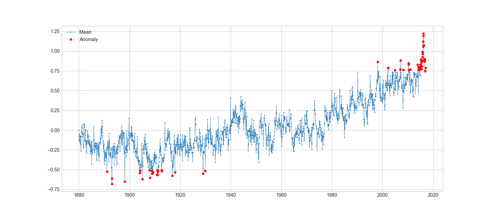

# Anomaly Detection

###### _Super simple and basic application of anomaly detection algorithms_

## What

This is a very basic application of anomaly detection algorithms,
which can be used in practically anything really.
 
You could use these to spot a bubble in data trends, like in the stock market,
or in something like a production pipeline where quality must be ensured.

## Algorithms Preset
- Threshold based detection
- Quantile based detection
- IQR based detection
- ESD based detection
- Persistance based detection
- Volatility based detection

## Usage
Currently a custom dataset is used. Simply use your own and apply your own parsing to it.
 
You can then just the `AnomalyDetection` class and apply it to your dataset.

## Demonstration
_Applying a basic threshold based detection to the data:_
  
